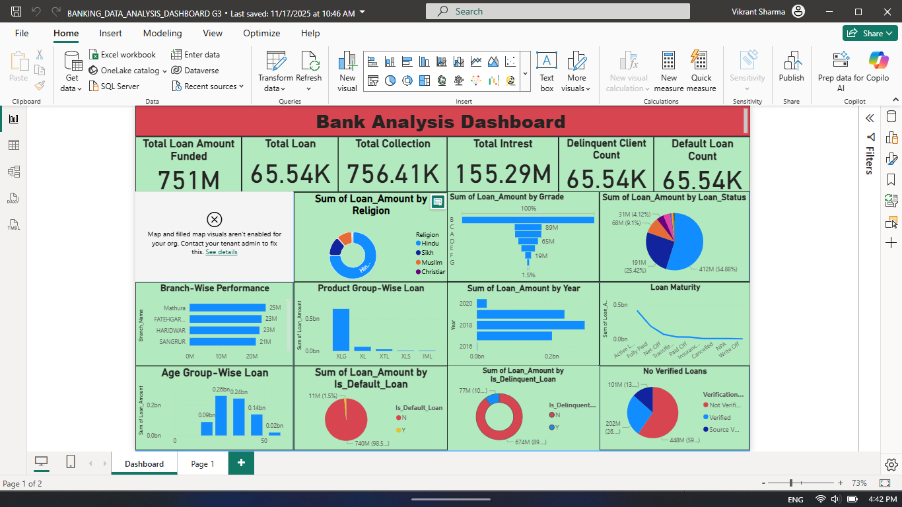
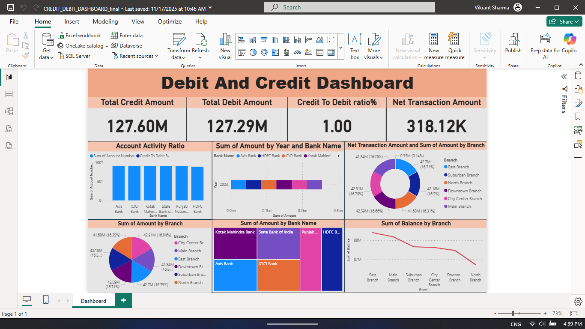
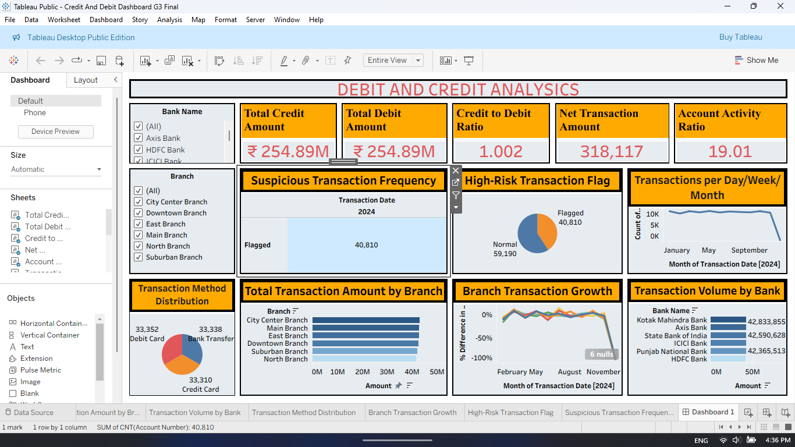
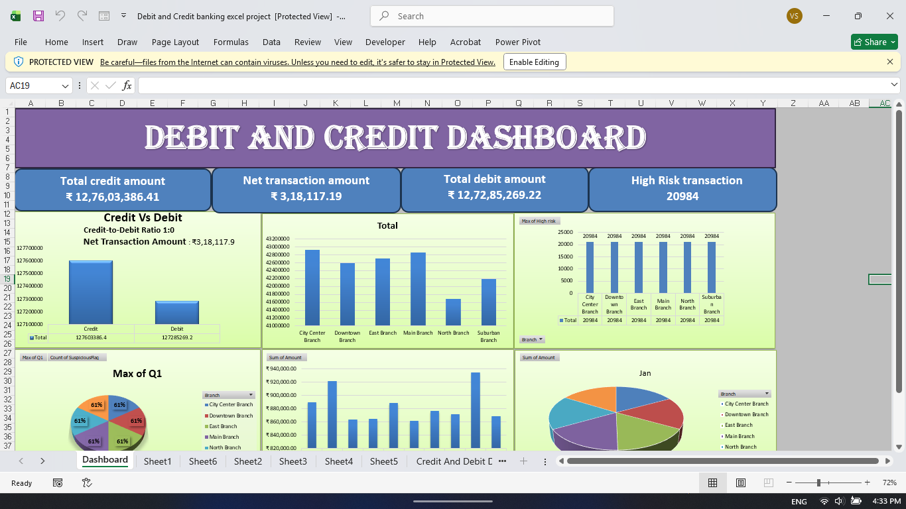

# Banking_Data_Analysis
Comprehensive analysis of banking &amp; transaction datasets. Includes 18 KPIs and interactive dashboards built using Excel, Power BI, Tableau, and MySQL to drive financial insights. Includes final executive presentation.

🏦 Banking & Transaction Performance Analytics
End-to-End Data Analysis Project | Excel, Power BI, Tableau, MySQL

📊 Project Overview
This project involved a deep-dive analysis of banking and credit/debit transaction datasets to uncover financial trends and customer behaviors. I developed 18 custom KPIs across multiple analytical platforms to demonstrate versatility in data handling and visualization.

🛠️ Technical Workflow
Data Cleaning: Performed extensive cleaning in Excel to handle null values and standardize transaction types.

Database Management: Leveraged MySQL for data extraction and complex joins between the banking and transaction tables.

Business Intelligence: * Power BI: Developed a dynamic dashboard focusing on year-over-year growth and liquidity ratios.

Tableau: Created interactive geographic maps to visualize regional transaction volumes.

Presentation: Summarized all findings into a professional PowerPoint deck for stakeholder review.

🎯 Key KPIs Developed
Customer Liquidity: Monitoring inflow vs. outflow of funds.

Churn Analysis: Identifying inactive accounts based on transaction frequency.

Credit vs. Debit Split: Analyzing consumer spending preferences.

📁 Files Included
excel project dashboard (3).xlsb: Full Excel analysis.

.pbix files: Power BI interactive reports.

.twbx files: Tableau visualization workbooks.

.sql files: All MySQL scripts used for data validation.

Final ppt.pptx: Executive summary and dashboard screenshots.

### 🖼️ Dashboard Gallery

#### Power BI Dashboard

#### Tableau Visualization

#### Excel Analytics

